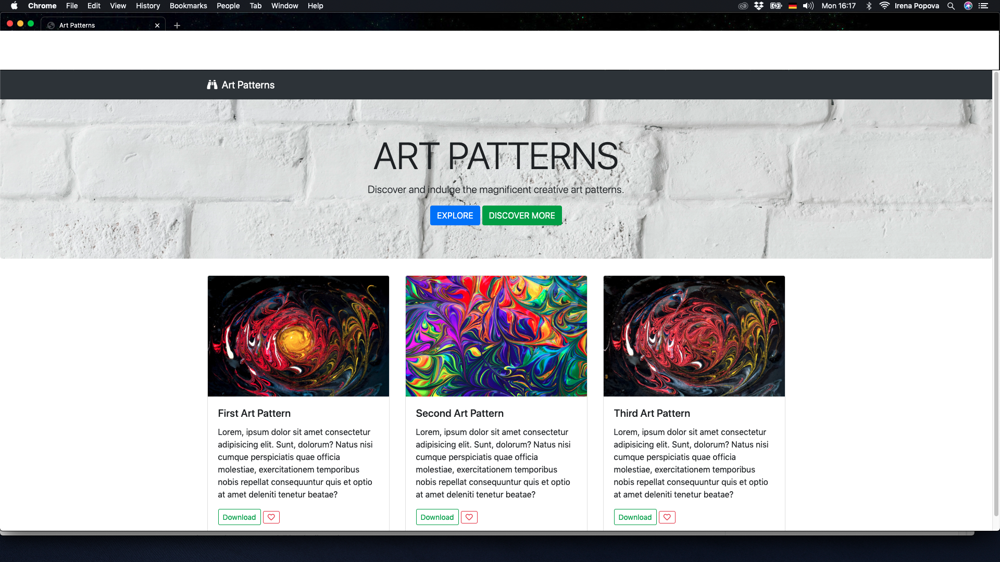

#### CSS - BOOTSTRAP 

#### DCI Assignment Task

#### The project is part of the study digital program at Digital Career Institute.

#### Screenshot



#### Files

- [Click here to view the HTML Code](index.html)

```css
/* style the Bootstrap classes
```

- [Click here to view the CSS Code](css/style.css)

### Resources

- [Intro to Bootstrap- Bootstrap ](https://getbootstrap.com/docs/4.4/layout/overview/)
- [Bootstrap Components- mdbootstrap](https://mdbootstrap.com/docs/jquery/components/demo/)

#### Result

[Screenshot]()
